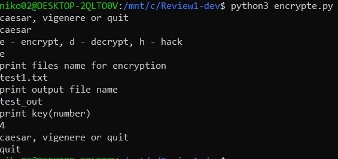
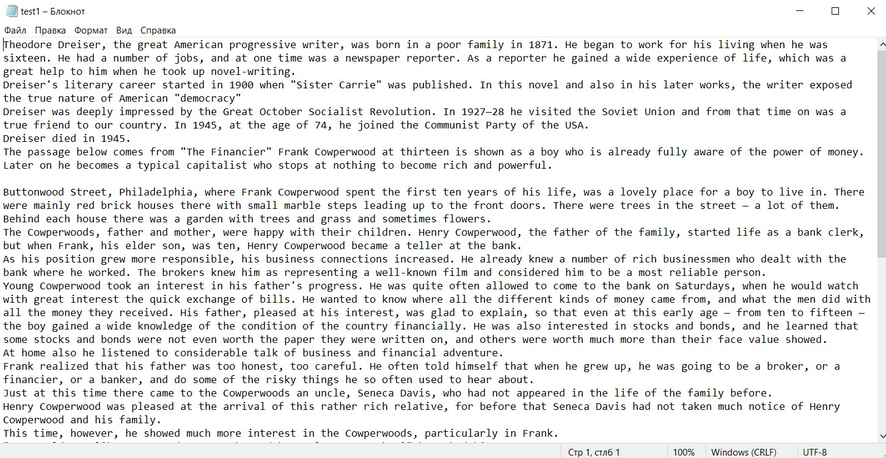

 Шифрование 
 
 Данный шифратор может зашифровать или расшифровать ваш текст шифром Цезаря или шифром Виженера. А также с помощью метода частичного анализа взломать шифр Цезаря, не зная ключа.
 
* Запуск командой python3 encrypte.py

caesar, vigenere or quit                - необходимо выбрать один из шифров или выйти

e - encrypt, d - decrypt, h - hack       - при выборе caesar 

e - encrypt, d - decrypt                 - при выборе vigenere

* далее программа просит указать файл, откуда читаем, потом файл куда считываем результат(создаётся сам, указать название) 
* затем (кроме hack) подаётся ключ шифрования  
* далее результат записывается в указанный выше файл и программа снова даёт выбрать, что делать дальше  

в файле func.py описаны функции шифрования и взлома, а в encrypte.py сама работа и запуск  

* Пример работы шифратора в консоли

* Текст и результат шифрования шифром Цезаря

* Пример  
